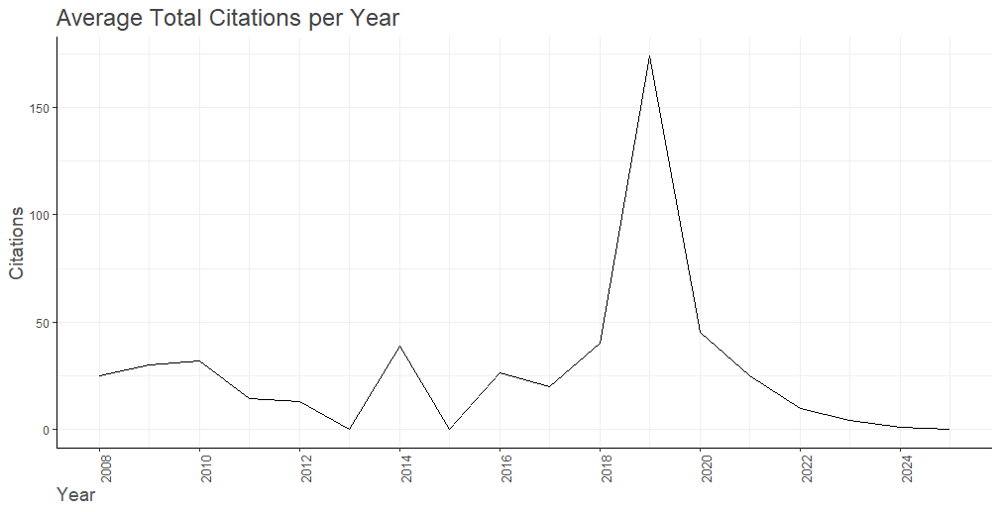

name: about-me
layout: false
class: about-me-slide, inverse, middle, center

```{r setup, include=FALSE}
options(htmltools.dir.version = FALSE)
knitr::opts_chunk$set(echo = TRUE, message = FALSE, warning = FALSE, tidy = TRUE)
```

```{r xaringan-logo2, echo=FALSE}
xaringanExtra::use_logo(
  image_url = "source/R_MY.jpg", 
  width = "50px",
  height = "60px"
)
```

## About me


<p style="font-size:20pt; font-weight:bold; font-family:lato">Tengku Muhammad Hanis Bin Tengku Mokhtar</p>    

**Founder and Academic Trainer, Jom Research**

**MBBCh, MSc (Medical Statistics), <br>PhD (Public Health Epidemiology)**

[`r fontawesome::fa("link")` tengkuhanis.netlify.app](https://tengkuhanis.netlify.app/)
[`r fontawesome::fa("twitter", a11y = "sem")` @tmhanis](https://twitter.com/tmhanis)
[`r fontawesome::fa("github", a11y = "sem")` @tengku-hanis](https://github.com/tengku-hanis)<br>
[`r fontawesome::fa("linkedin", a11y = "sem")` @Tengku Muhammad Hanis](https://www.linkedin.com/in/tengku-muhammad-hanis-9a7222144/)

[`r fontawesome::fa("link")` jomresearch.netlify.app](https://jomresearch.netlify.app/)

---

## COVID-19

- Coronavirus disease (COVID-19) is an infectious disease caused by the SARS-CoV-2 virus
- The virus has affected countries globally, including Malaysia 
- Since the outbreak, extensive research has been conducted to understand and manage the disease
- Thus, we can use a bibliometric analysis to explore the landscape of this research area 

```{r, echo=FALSE, out.width='50%', fig.align='center'}

```

---

## Bibliometric analysis

- Bibliometric analysis is an umbrella term for a set of analyses 
- Basically, it refers to an analysis of bibliographic information
- Bibliometric analysis is explorative in nature
- In this talk, we going to use both R (bibliometrix) and Python (pyBibX)

```{r, echo=FALSE, out.width='70%', fig.align='center'}

```

---

## Data and search strategy

| Parameters    | Details             |
| ------------- |:-------------------:|
| Database      | Scopus              |
| Date searched | September30, 2024   |
| Search terms  | TITLE ( covid-19 ) OR TITLE ( covid ) OR TITLE ( 2019-ncov ) OR TITLE ( coronavirus ) AND ( LIMIT-TO ( AFFILCOUNTRY , "Malaysia" ) ) AND ( LIMIT-TO ( DOCTYPE , "ar" ) OR LIMIT-TO ( DOCTYPE , "cp" ) OR LIMIT-TO ( DOCTYPE , "re" ) OR LIMIT-TO ( DOCTYPE , "ch" ) OR LIMIT-TO ( DOCTYPE , "ed" ) OR LIMIT-TO ( DOCTYPE , "bk" ) )     | 
| Results       | 5,995               |

---

## Analysis in R

Packages:

```{r}
library(dplyr)
library(ggplot2)
library(bibliometrix)
```

```{r echo=FALSE, message=FALSE, warning=FALSE, results='hide'}
covid_data <- readRDS('source/covid_data.rds')
```

Descriptive:

```{r eval=FALSE}
res <- biblioAnalysis(covid_data)
summary(res, k = 10)
```

```{r echo=FALSE}
res <- biblioAnalysis(covid_data)

summary_output <- capture.output(summary(res, k = 10))
cat(summary_output[1:11], sep = "\n")
```

---

## Analysis in R (cont.)

Basic plots:

```{r eval=FALSE}
allplots <- plot(res) # we get 5 plots here
```

```{r eval=FALSE}
allplots$AnnualScientProd
```

```{r, echo=FALSE, out.width='65%', fig.align='center'}

```

---

## Analysis in R (cont.)

```{r eval=FALSE}
allplots$AverTotCitperYear
```

```{r, echo=FALSE, out.width='80%', fig.align='center'}

```

---

## Analysis in R (cont.)

Top authors in the research area:

```{r eval=FALSE}
authorProdOverTime(covid_data, k=10)
```


```{r, echo=FALSE, out.width='80%', fig.align='center'}

```

---

## Analysis in R (cont.)

thematic map:

```{r eval=FALSE}
thematicMap(covid_data, field = 'DE', n.labels = 5)
```

```{r, echo=FALSE, out.width='75%', fig.align='center'}

```

---

## Analysis in Python 

Install libraries:

- Make sure to install reticulate package first (if using RStudio)
- Some of the functions are not well executed in RStudio

```{python eval=FALSE}
reticulate::py_install('pyBibX')
```

Load libraries

```{python eval=FALSE}
import numpy as np
import pandas as pd
import textwrap

from pyBibX.base import pbx_probe #read data
```

---

## Analysis in Python (cont.)

Most common n-grams from author's keywords (entry = 'kwa')

```{python eval = FALSE}
rm = ['2019', 'disease', '19', 'pandemic'] #remove few words
cov_data.get_top_ngrams(view = 'notebook', entry = 'kwa', ngrams = 2, stop_words = ['en'], rmv_custom_words = rm, wordsn = 15)
```

```{r, echo=FALSE, out.width='72%', fig.align='center'}

```

---
## Analysis in Python (cont.)

Top keywords evolution for the last 10 years:

```{python eval=FALSE}
rm2 = ['pandemic', 'covid', 'covid-19', 'sars-cov-2', 'coronavirus', 'malaysia', 'covid-19 pandemic']
cov_data.plot_evolution_year(view = 'notebook', stop_words = ['en'], rmv_custom_words = rm2, key = 'kwa', topn = 5, txt_font_size = 12, start = 2015, end = 2024)
```

```{r, echo=FALSE, out.width='50%', fig.align='center'}

```

---

## Analysis in Python (cont.)

Let's focus on the first first 5 years (2015-2019)

```{python eval=FALSE}
cov_data.plot_evolution_year(view = 'notebook', stop_words = ['en'], rmv_custom_words = rm2, key = 'kwa', topn = 5, txt_font_size = 12, start = 2015, end = 2019)
```

```{r, echo=FALSE, out.width='52%', fig.align='center'}

```

---

## Analysis in Python (cont.)

Next, let's see the next 5 years (2020-2024)

```{python eval=FALSE}
cov_data.plot_evolution_year(view = 'notebook', stop_words = ['en'], rmv_custom_words = rm2, key = 'kwa', topn = 5, txt_font_size = 12, start = 2019, end = 2024)
```

```{r, echo=FALSE, out.width='52%', fig.align='center'}

```

---

## Analysis in Python (cont.)

Tree map of countries:

```{python eval=FALSE}
cov_data.tree_map(entry = 'ctr', topn = 20, size_x = 30, size_y = 15, txt_font_size = 22)
```

```{r, echo=FALSE, out.width='75%', fig.align='center'}

```

---

## Analysis in Python (cont.)

Further details on countries collaboration:

```{python eval=FALSE}
cov_data.network_adj_map(view = 'notebook', connections = False, country_lst = [])
```

```{r, echo=FALSE, out.width='55%', fig.align='center'}

```

---

## Analysis in Python (cont.)

Alternatively, we can use bibliometrix package from R:
 
```{r eval=FALSE}
# Extract authors' countries
author_country <- metaTagExtraction(dat, Field = "AU_CO")

# Country collab network
country_collab <- biblioNetwork(author_country, analysis = "collaboration",  network = "countries")

# Plot the network
set.seed(123)
networkPlot(country_collab, n = 20, cluster = "none", Title = "Collaboration between top 20 countries using bibliometrix (R)", type = "auto", size.cex = T)
```

```{r, echo=FALSE, out.width='50%', fig.align='center'}

```

---

## Conclusion

- We have a good research landscape especially in terms of availability of the experts and collaboration between countries
- We see a few dominant research area such as COVID-19 research related online learning and mental health
- COVID-19 research in Malaysia before 2019 were almost non-existent
- COVID-19 research related to AI especially deep learning in Malaysia have yet to be extensively studied

---

## Some remarks

- Both bibliometrix (R) and pyBibX (python) have their own advantages
- bibliometrix vs pyBibX :
  - pyBibX is a little bit heavier to run (biased opinion)
  - pyBibX takes a bit more effort to be able to run smoothly in RStudio
  - pyBibX is a larger package (and probably more powerful) than bibliometrix
- Both packages have several similar overlapped functions
- Both packages have limited documentations

```{r echo=FALSE, out.width="40%", out.extra='style="background-color: #4131e8; padding:2px;"'}
knitr::include_graphics(c('source/bibliometrix_logo.png', 'source/pybibx_logo.png'))
```

---

## Suggested readings

- About bibliometric analysis:
  - [bibliometrix : An R-tool for comprehensive science mapping analysis](https://doi.org/10.1016/j.joi.2017.08.007)
  - [How to conduct a bibliometric analysis: An overview and guidelines. Journal of Business Research](https://doi.org/10.1016/j.jbusres.2021.04.070)
  - [Preliminary guideline for reporting bibliometric reviews of the biomedical literature (BIBLIO): a minimum requirements](https://doi.org/10.1186/s13643-023-02410-2) 
- pyBibX: https://github.com/Valdecy/pyBibX
- bibliometrix: https://github.com/massimoaria/bibliometrix

---

class: center, middle

# Thank you!

.center[`r fontawesome::fa("link")` Slides: https://tinyurl.com/biblio-rconference2022]

```{r, echo=FALSE, out.width='25%'}
knitr::include_graphics("source/qrcode.png", dpi = NA)
```


